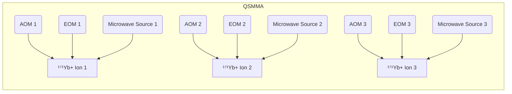
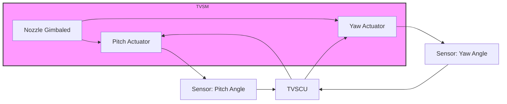
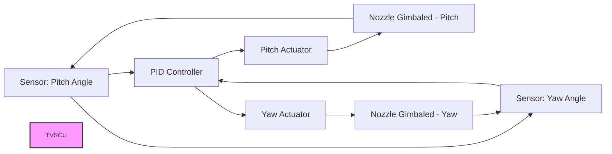

# GAIA Model: A Sustainable and Intelligent Aerospace Ecosystem

This document outlines the GAIA Model, a comprehensive and integrated ecosystem designed to revolutionize aerospace innovation and operations through the synergistic application of cutting-edge technologies.

## Executive Summary

The GAIA Model aims to transform the aerospace industry by integrating quantum propulsion, artificial intelligence (AI), robotics, and advanced materials. Our mission is to create a sustainable, intelligent, and interconnected aerospace ecosystem that enhances operational efficiency, minimizes environmental impact, and promotes equitable advancements in aviation and space exploration. Key principles guiding GAIA include adaptability, intelligence, sustainability, interconnectedness, and equity. Core components comprise the Cosmic Omnidevelopable Aero Foresights Index (COAFI), the Quantum Propulsion System (Q-01), ROBBBO-T robotic fleets, advanced AI systems, and the flagship Ampel360XWLRGA aircraft. Enabling technologies include quantum computing, AI/machine learning, blockchain, next-generation sensing, advanced materials, and digital twin technology. Strategic objectives focus on technological leadership, operational efficiency, sustainability, scalability, safety, and collaborative innovation. We invite collaboration and investment to realize this transformative vision.

## Table of Contents

1. [Executive Summary](#executive-summary)
2. [Acronyms and Abbreviations](#acronyms-and-abbreviations)
3. [Overview](#overview)
4. [Hierarchical Structure](#hierarchical-structure)
5. [Core Components](#core-components)
    - [COAFI (Cosmic Omnidevelopable Aero Foresights Index)](#coafi-cosmic-omnidevelopable-aero-foresights-index)
    - [Quantum Propulsion System (Q-01)](#quantum-propulsion-system-q-01)
    - [Ampel360XWLRGA - Flagship Aircraft](#ampel360xwlrga---flagship-aircraft)
    - [ROBBBO-T Robotic Fleets](#robbbo-t-robotic-fleets)
    - [Advanced AI Systems](#advanced-ai-systems)
    - [Knowledge & Data Management](#knowledge--data-management)
    - [Infrastructure Components](#infrastructure-components)
6. [Enabling Technologies](#enabling-technologies)
    - [Quantum Computing](#quantum-computing)
    - [AI & Machine Learning](#ai--machine-learning)
    - [Blockchain](#blockchain)
    - [Next-Generation Sensing](#next-generation-sensing)
    - [Advanced Materials](#advanced-materials)
    - [Digital Twin Technology](#digital-twin-technology)
7. [System Interconnections & Integration](#system-interconnections--integration)
8. [Future-Proofing & Scalability](#future-proofing--scalability)
9. [Applications & Use Cases](#applications--use-cases)
    - [Ampel360XWLRGA Use Cases](#ampel360xwlrga-use-cases)
10. [Strategic Objectives](#strategic-objectives)
11. [Risk Assessment & Mitigation](#risk-assessment--mitigation)
12. [Economic Analysis](#economic-analysis)
13. [Deployment Timeline](#deployment-timeline)
14. [Integration with External Systems](#integration-with-external-systems)
15. [Public Engagement & Education](#public-engagement--education)
16. [References](#references)
17. [Appendices](#appendices)

## Acronyms and Abbreviations

| **Acronym** | **Full Form** | **Description** |
|-------------|---------------|------------------|
| AI          | Artificial Intelligence | Systems simulating human intelligence processes. |
| API         | Application Programming Interface | Set of protocols for building and interacting with software applications. |
| ATA         | Air Transport Association | Organization establishing standards for aircraft systems and components. |
| CFD         | Computational Fluid Dynamics | Branch of fluid mechanics using numerical analysis for fluid flow simulations. |
| CFRP        | Carbon Fiber Reinforced Polymers | Composite materials known for high strength and lightweight properties. |
| COAFI       | Cosmic Omnidevelopable Aero Foresights Index | Comprehensive framework for aerospace innovation and project management; central knowledge and foresight index. |
| DO-178C     | Software Considerations in Airborne Systems & Equipment Certification | Guidelines for aviation software development and certification. |
| DO-254      | Design Assurance Guidance for Airborne Electronic Hardware | Guidelines for aviation electronic hardware development and certification. |
| FAA         | Federal Aviation Administration | National aviation authority of the United States. |
| EASA        | European Union Aviation Safety Agency | Aviation authority of the European Union. |
| FEA         | Finite Element Analysis | Numerical method for predicting structural responses to forces. |
| ISO         | International Organization for Standardization | International standard-setting body. |
| MTBF        | Mean Time Between Failures | Reliability metric for systems and components. |
| NDT         | Non-Destructive Testing | Techniques for evaluating materials without causing damage. |
| Q-01        | Quantum Propulsion System | Proprietary quantum propulsion technology. |
| QA          | Quality Assurance | Processes ensuring products meet quality standards. |
| ROBBBO-T    | Robotic Operations, Building, & Base Bearing Ops - Terrestrial | Family of robotic systems designed for various aerospace applications. |
| TRL         | Technology Readiness Level | Measure of technology maturity (1-9). |
| VCS         | Version Control System | Software tools for tracking changes to code or documents. |
| GDPR        | General Data Protection Regulation | EU regulation on data protection and privacy. |
| OSHA        | Occupational Safety and Health Administration | US agency ensuring workplace safety. |
| IEEE        | Institute of Electrical and Electronics Engineers | Professional association for electrical and electronic engineering. |
| ASME        | American Society of Mechanical Engineers | Professional association promoting multidisciplinary engineering and allied sciences. |

## Overview

The GAIA Model is a dynamic, adaptive system that continuously evolves through the integration of new technologies, research, and operational feedback. It functions as both a knowledge repository and operational framework, facilitating seamless collaboration to achieve unprecedented levels of efficiency, sustainability, and innovation in aerospace operations. Key attributes include its dynamic and adaptive nature, modular and hierarchical structure, integrated knowledge hub, and commitment to sustainable and ethical practices.

## Hierarchical Structure

Inspired by biological systems, the GAIA Model's hierarchical structure comprises:

- **Cells (Technological Units):** Fundamental building blocks representing individual technologies or subsystems (e.g., Q-01 submodules, AI microservices).
- **Tissues (Technological Assemblies):** Groups of cells working together to perform complex functions (e.g., quantum computing clusters, robotic squads).
- **Strata (Operational Layers):** Higher-level integrations coordinating multiple tissues to achieve strategic objectives (e.g., Mobility Layer, Knowledge Layer).
- **Organs (System Clusters):** Comprehensive assemblies combining multiple strata to fulfill major ecosystem functions (e.g., Transportation Systems, R&D Systems).
- **Systems (Ecosystem Integration):** The overarching GAIA ecosystem encompassing all organs and their interactions.

This structure ensures independent component operation while contributing to the overall functionality and adaptability of the ecosystem.

## Core Components

### COAFI (Cosmic Omnidevelopable Aero Foresights Index)

*To be developed with detailed specifications and functionalities.*

### Quantum Propulsion System (Q-01)

*Detailed in Appendix A: Technical Specifications.*

### Ampel360XWLRGA - Flagship Aircraft

*To be developed with detailed specifications and use cases.*

### ROBBBO-T Robotic Fleets

*Detailed in Appendix A: Technical Specifications.*

### Advanced AI Systems

*To be developed with detailed specifications and applications.*

### Knowledge & Data Management

*To be developed with detailed specifications and integration strategies.*

### Infrastructure Components

*To be developed with detailed specifications and operational guidelines.*

## Enabling Technologies

### Quantum Computing

*To be developed with detailed specifications and applications.*

### AI & Machine Learning

*To be developed with detailed specifications and applications.*

### Blockchain

*To be developed with detailed specifications and applications.*

### Next-Generation Sensing

*To be developed with detailed specifications and applications.*

### Advanced Materials

*To be developed with detailed specifications and applications.*

### Digital Twin Technology

*To be developed with detailed specifications and applications.*

## System Interconnections & Integration

*To be developed with detailed specifications and integration methodologies.*

## Future-Proofing & Scalability

*To be developed with strategies for scalability and adaptability to future technologies.*

## Applications & Use Cases

### Ampel360XWLRGA Use Cases

*To be developed with specific scenarios and operational details.*

## Strategic Objectives

*To be developed with detailed strategic goals and milestones.*

## Risk Assessment & Mitigation

*To be developed with comprehensive risk identification, analysis, and mitigation strategies.*

## Economic Analysis

*To be developed with financial projections, cost-benefit analysis, and funding strategies.*

## Deployment Timeline

*To be developed with phased implementation plans, milestones, and deadlines.*

## Integration with External Systems

*To be developed with specifications on interfacing with external tools and platforms.*

## Public Engagement & Education

*To be developed with strategies for public outreach, education programs, and stakeholder engagement.*

## References

*To be compiled with all sources cited in the document, formatted consistently (e.g., APA or IEEE style).*

## Appendices

### Appendix A: Technical Specifications

#### A.1 Quantum Entanglement Engine (QEE)

##### A.1.2 Particle Source (PS)

###### A.1.2.1 Quantum Entanglement Engine (QEE):

###### A.1.2.1.1 Particle Source (PS):

**Type of Ions:**

- **Species:** Ytterbium ions (¹⁷¹Yb+).
  
- **Rationale:** ¹⁷¹Yb+ is chosen due to its suitable energy level structure for optical pumping and long coherence times, making it ideal for quantum entanglement experiments. It possesses a nuclear spin of 1/2, providing a good qubit system with long coherence times. The relatively simple electronic structure of Yb+ simplifies state preparation and manipulation.

**Source:**

- A solid Ytterbium sample is heated within a vacuum chamber to produce neutral Ytterbium atoms.

**Trapping Mechanism:**

- **Type:** Electromagnetic trapping using a combination of radio-frequency (RF) Paul trap and a linear Paul trap.
  
- **RF Paul Trap:** A quadrupole RF field confines the ions in two dimensions (radial). The RF field is generated by applying an oscillating voltage to electrodes within the vacuum chamber. The frequency and amplitude of the RF field are critical parameters for stable trapping.
  
- **Linear Paul Trap:** Extends the confinement to three dimensions by adding DC voltage to endcap electrodes, creating a potential well along the axial direction. This linear configuration allows for the formation of ion chains or strings.

**Trap Geometry:**

- Detailed description of the trap geometry, including electrode shapes, dimensions, materials, and spacing.
  
- *[Insert high-resolution diagram of the trap setup here]*

**Operating Parameters:**

- **RF Frequency:** 10-50 MHz
  
- **RF Amplitude:** 100-500 V
  
- **DC Endcap Voltage:** 5-20 V
  
- **Vacuum Pressure:** <10⁻¹⁰ Torr

**Ion Preparation:**

- **Ionization:** Neutral Yb atoms are ionized via a two-step photoionization process:
  
  1. A 399 nm laser excites the atoms from the ground state (¹S₀) to an intermediate state (¹P₁).
  
  2. A second laser (around 369.5 nm) further excites the atoms to an auto-ionizing state, leading to ionization and the creation of ¹⁷¹Yb+ ions.

**Laser Cooling:**

- **Doppler Cooling:**
  
  - **Method:** Doppler cooling using a 369.5 nm laser, slightly red-detuned from the ²S₁/₂ to ²P₁/₂ transition.
  
  - **Process:** Slows down ions by using the Doppler effect, cooling them to near the Doppler limit (~500 µK).

- **Sideband Cooling:**
  
  - **Method:** Resolved sideband cooling on the narrow ²S₁/₂ to ²D₃/₂ transition using Raman transitions with 2000 nm and 2002 nm lasers.
  
  - **Process:** Further reduces kinetic energy to reach temperatures around 10 µK.

**State Manipulation (Initialization):**

- **Optical Pumping:**
  
  - **Method:** Uses 369.5 nm laser and microwave fields to prepare ions in the |0⟩ state (|F=0, mF=0>).

- **Qubit State Verification:**
  
  - **Method:** Fluorescence detection via the 369.5 nm transition.

**Stability/Lifetime:**

- **Trap Lifetime:** >12 hours.

- **Automatic Ion Replenishment:**
  
  - **Detection:** Monitors fluorescence to detect ion loss.
  
  - **Replenishment:** Automatically loads new ions via laser ablation of Yb target within ~3 seconds.
  
  - **Reestablishment:** Retunes lasers and reestablishes operating parameters within 500 ms.

**Generation Rate:**

- **Target:** 30,000 ions/hour (including replenishment time).
  
- **Process:**
  
  - Ionization and trapping: ~1 second
  
  - Doppler Cooling: ~100 ms
  
  - Sideband Cooling: ~500 ms
  
  - State Initialization: ~10 ms
  
  - Verification: ~5 ms
  
  - Replenishment Cycle Overhead: ~500 ms

**Ion Number Control:**

- **Method:**
  
  - **Fluorescence Monitoring:** Continuously monitors fluorescence intensity to estimate ion number.
  
  - **Trap Parameter Adjustment:** Adjusts RF/DC voltages to control trapping potential.
  
  - **Ionization Rate Control:** Adjusts laser power and neutral atom flux to control ion generation rate.

**Control Loop Diagram:**

```mermaid
graph LR
    A[Fluorescence Detection] --> B{Ion Number within Range?}
    B -- No --> C[Adjust Trap Parameters (RF/DC)]
    B -- No --> D[Adjust Ionization Rate]
    C --> A
    D --> A
    B -- Yes --> E[Maintain Current Settings]
    E --> A
    style process fill:#f9f,stroke:#333,stroke-width:2px
```

**Temperature Control:**

- **Target:** 10 µK
  
- **Method:** Combination of Doppler and sideband cooling techniques.
  
- **Measurement:** Doppler broadening analysis and resolved sideband spectroscopy.

**Control and Interface:**

- **Control System:**
  
  - **Hardware:** FPGA-based real-time control system integrated with the Quantum State Modulator (QSM) Control Unit (CU).
  
  - **Software:** Real-time algorithms for laser modulation and trap parameter adjustments based on feedback.

**Key Performance Indicators (KPIs):**

| **Parameter**                     | **Value** | **Unit** | **Notes**                                              |
|-----------------------------------|-----------|----------|--------------------------------------------------------|
| Ion Cloud Entanglement Fidelity   | >99.9     | %        | Measured at 70% of the maximum generation rate.        |
| Entanglement Creation Rate        | 10        | pairs/minute |                                                        |
| Trap Lifetime                     | >12       | hours    |                                                        |
| Ion Loading Rate                  | 30,000    | ions/hour | Including replenishment time.                         |
| Vacuum Pressure                   | <10⁻¹⁰    | Torr     | Ultra-high vacuum to minimize collisions.              |

---

#### A.1.2.2 Quantum State Modulator (QSM)

##### A.1.2.2.3 QSM Modulation Array (QSMMA)

**Modulator Type:**

- **Acousto-Optic Modulators (AOMs):**
  
  - **Rationale:** High-speed modulation, precise control over laser beam intensity, and frequency shifting capabilities.

- **Electro-Optic Modulators (EOMs):**
  
  - **Rationale:** Extremely fast phase modulation for high-fidelity quantum gate operations.

- **Microwave Sources:**
  
  - **Rationale:** Drives transitions between hyperfine ground states of ¹⁷¹Yb+ ions with high fidelity and long coherence times.

**Modulation Capabilities:**

- **AOMs:**
  
  - **Frequency Shift Range:** 50 MHz to 500 MHz
  
  - **Amplitude Modulation:** 0% to 100% modulation depth
  
  - **Switching Time:** <50 ns
  
  - **Precision:**
    
    - **Frequency Shift:** <1 kHz
    
    - **Amplitude:** <0.1%

- **EOMs:**
  
  - **Phase Modulation Range:** 0 to 2π radians
  
  - **Bandwidth:** >1 GHz
  
  - **Precision:** <0.01 radians

- **Microwave Sources:**
  
  - **Frequency Range:** 12.6 GHz
  
  - **Power Output:** Up to 20 dBm
  
  - **Phase Control:** Full phase control capability
  
  - **Switching Time:** <10 ns

**Array Architecture:**

- **Number of Modulators:** 128 independent channels
  
- **Spatial Layout:** Linear array corresponding to the ion chain in the linear Paul trap.

**Diagram:**



**Control Mechanism:**

- **Control Signals:** Digital control signals generated by the Control Unit (CU) are sent to each modulator.
  
- **Synchronization:** Precisely synchronized control to maintain qubit coherence.
  
- **Digital-to-Analog Conversion:** High-speed DACs convert digital signals to analog for modulators.
  
- **Microwave Control:** Precise frequency, power, and phase adjustments via microwave controllers.
  
- **Protocol:** Custom high-speed, low-latency communication protocol (e.g., LVDS).

**Beam Shaping:**

- **Focusing Optics:** Lenses and mirrors shape and focus laser beams onto individual ions.
  
- **Beam Steering:** MEMS mirrors allow dynamic adjustment of beam position for precise targeting.
  
- **Pulse Shaping:** Combination of AOMs and EOMs to create complex laser pulse shapes (Gaussian, square, etc.).

**Stability and Calibration:**

- **Temperature Stabilization:** Temperature-controlled environment to minimize thermal drift.
  
- **Active Feedback Loops:** Use photodiodes and PID controllers to stabilize laser parameters.
  
- **Calibration Routines:** Automated calibration for frequency, amplitude, and phase stability.

**Key Performance Indicators (KPIs):**

| **KPI**                       | **Target Value** | **Unit** | **Description**                                        |
|-------------------------------|------------------|----------|--------------------------------------------------------|
| Modulation Bandwidth          | >1               | GHz      | Maximum frequency at which modulators can change laser beam properties. |
| Amplitude Stability           | <0.1             | %        | Stability of laser beam intensity after modulation (RMS). |
| Phase Stability               | <0.01            | radians  | Stability of laser beam phase after modulation (RMS).   |
| Switching Time                | <1               | ns       | Time taken for modulators to switch between states.     |
| Channel Crosstalk             | < -60            | dB       | Signal leakage between modulation channels.             |
| Number of Addressable Channels | 128              | -        | Number of ions that can be independently controlled.    |
| Frequency Stability (AOM)     | <1               | kHz      | Stability of frequency shifts applied by AOMs.          |
| Phase Control Resolution      | <0.001           | radians  | Smallest increment in phase adjustment by EOMs.         |
| Microwave Power Stability     | <0.1             | dBm      | Stability of microwave power output.                    |
| Control Signal Jitter         | <5               | ps       | Variation in timing of control signals generated by the CU. |

**Table: Key Performance Indicators (KPIs) for QSM Modulation Array (QSMMA)**

---

### A.1.2.3 Energy Source and Management

#### A.1.2.3.1 Energy Conditioning Unit (ECU)

**1. Input Power**

| **Aspecto**                 | **Descripción / Description**                                     |
|-----------------------------|-------------------------------------------------------------------|
| **Fuente de Entrada**       | High-precision DC power supply.                                  |
| **Tipo / Type**             | High-precision DC power supply.                                  |
| **Voltaje de Entrada**      | 400 V DC                                                          |
| **Corriente de Entrada**    | 25 A                                                              |
| **Potencia Nominal**        | 10 kW                                                             |
| **Frecuencia / Frequency**  | N/A (DC input)                                                    |
| **Características Adicionales / Additional Characteristics** | - **Redundancia / Redundancy:** Dual-feed configuration to ensure continuity in case one feed fails.<br>- **Protección contra Inversión de Polaridad / Reverse Polarity Protection:** Prevents damage if the source is mistakenly connected with reversed polarity. |

**2. Output Power**

| **Aspecto**                     | **Descripción / Description**                                       |
|---------------------------------|---------------------------------------------------------------------|
| **Características de Salida**   | - **Voltajes de Salida / Output Voltages:**<br>  - 5 V DC: For low-power control circuits.<br>  - 12 V DC: For digital logic and communication modules.<br>  - 48 V DC: For high-power lasers and critical RF/DC components.<br>- **Corrientes de Salida / Output Currents:**<br>  - 5 V DC: Up to 10 A.<br>  - 12 V DC: Up to 20 A.<br>  - 48 V DC: Up to 100 A.<br>- **Regulación de Voltaje / Voltage Regulation:**<br>  - **Precisión / Accuracy:** ±0.05% (5 V, 12 V), ±0.1% (48 V).<br>- **Estabilidad (Ripple & Noise) / Ripple & Noise Stability:**<br>  - <50 mV RMS (5 V).<br>  - <100 mV RMS (12 V).<br>  - <200 mV RMS (48 V).<br>- **Filtros y Supresión de Ruido / Filtering & Noise Suppression:**<br>  - **Filtros EMI/RFI:** Built-in to minimize electromagnetic (EMI) and radiofrequency interference (RFI).<br>  - **Capacitores de Bypass:** Bypass capacitors near load points to reduce high-frequency noise. |

**3. Power Regulation**

| **Aspecto**                           | **Descripción / Description**                                        |
|---------------------------------------|----------------------------------------------------------------------|
| **Regulación de Voltaje y Corriente** | - **Controladores de Regulación / Regulators:** Combination of linear & switching regulators ensures stable outputs under varying loads.<br>- **Monitoreo en Tiempo Real / Real-time Monitoring:** Continuous feedback loops adjust output in real time.<br>- **Filtros y Supresión de Ruido / Filtering & Noise Suppression:**<br>  - **Filtros de Línea / Line Filters:** Attenuate low-frequency noise to improve power quality.<br>  - **Capacitores de Alta Frecuencia / High-Frequency Capacitors:** Filter out switching noise to protect sensitive quantum components. |

**4. Efficiency**

| **Aspecto**                        | **Descripción / Description**                                           |
|------------------------------------|-------------------------------------------------------------------------|
| **Eficiencia Global / Overall Efficiency** | **Target:** >90% (at full load, 10 kW).<br>**Método / Measurement:** Compare total output power to total input power.<br>**Eficiencia en Diferentes Regímenes de Carga / Efficiency at Different Load Levels:**<br>  - **Full Load:** >90%.<br>  - **Partial Load:** >92%.<br>  - **Low Load:** >95%.<br>**Optimización / Optimization:**<br>  - **Conversión Conmutada / Switched-Mode Conversion:** Maximizes efficiency over varying loads.<br>  - **Gestión Térmica / Thermal Management:** Heatsinks and airflow control reduce thermal losses. |

**5. Protection Mechanisms**

| **Aspecto**                             | **Descripción / Description**                                     |
|-----------------------------------------|-------------------------------------------------------------------|
| **Protecciones Implementadas / Implemented Protections** | - **Sobrevoltaje (OVP) / Over-Voltage Protection:** MOVs and TVS diodes clamp high voltage spikes, triggered at 110% of the nominal voltage.<br>- **Sobrecorriente (OCP) / Over-Current Protection:** Fast-blow fuses and current-limit circuits, triggered at 120% of the nominal current.<br>- **Cortocircuito (SCP) / Short-Circuit Protection:** Immediate shutdown upon short detection.<br>- **Protección Térmica (Thermal Protection):** Over-temperature sensing triggers shutdown at 80°C.<br>- **Aislamiento Galvánico / Galvanic Isolation:** Optical isolation for critical outputs.<br>- **Alarmas y Señales de Estado / Alarms & Status Signals:** LED indicators and system alerts (COAFI). |

**6. Control Interface**

| **Aspecto**                             | **Descripción / Description**                                     |
|-----------------------------------------|-------------------------------------------------------------------|
| **Interfaz de Monitoreo y Control / Monitoring & Control Interface** | - **Protocolos de Comunicación / Communication Protocols:** I²C, SPI, CAN for interaction with the Control Unit (CU) and energy management subsystems.<br>- **Software de Supervisión / Supervisory Software:** COAFI-based dashboards offer real-time power parameter visualization.<br>- **Sensores de Estado / Real-Time Sensing:** Continuous sensing ensures rapid protection and adjustment. |

**Key Performance Indicators (KPIs):**

| **KPI**                         | **Target Value** | **Unit** | **Description**                                               |
|---------------------------------|------------------|----------|---------------------------------------------------------------|
| ECU Efficiency                  | >90              | %        | Overall efficiency comparing ECU output to input power.        |
| ECU Output Voltage Stability    | <0.1             | %        | Max variation in output voltage under varying load conditions.|
| ECU Output Current Stability    | <0.1             | %        | Max variation in output current under different operating conditions. |
| ESB Energy Density (Li-ion)     | >200             | Wh/kg    | Energy density for Li-ion batteries.                          |
| ESB Charge/Discharge Cycle Life | >5000            | Cycles   | Number of charge/discharge cycles Li-ion batteries can sustain before capacity reduction. |
| ESB Self-Discharge Rate         | <1               | %/month  | Monthly self-discharge of Li-ion batteries during storage at 25°C. |
| ESB Recharge Time               | <1               | Hour     | Time required to fully recharge the ESB from a depleted state. |
| Supercapacitor Efficiency       | >98              | %        | Charge/discharge efficiency, indicating how much stored energy is recoverable. |
| Supercapacitor Cycle Life       | >1,000,000       | Cycles   | Number of high-rate charge/discharge cycles before noticeable performance degradation. |
| Peak Power Output               | ~1               | MW       | Combined Li-ion + supercapacitor peak output for brief high-power demands. |
| Protection Mechanisms           | Multiple         | -        | Over-voltage, over-current, short-circuit, thermal protection built into ECU and ESB. |
| Monitoring & Control Interface  | I²C, SPI, CAN     | -        | Communication protocols for real-time data exchange and remote control (via COAFI). |
| Thermal Management              | <80              | °C       | Operating temperature limit to ensure optimal performance and reliability of ECU and ESB components. |

**Table: Key Performance Indicators (KPIs) for Energy Source and Management**

**Diagram: Block Diagram of the Energy Source and Management System**

```mermaid
graph TD
    subgraph Energy Source and Management
        INPUT[400V DC Input] --> ECU[Energy Conditioning Unit (ECU)]
        ECU -->|5V, 12V, 48V DC| BATT[Lithium-Ion Batteries]
        ECU -->|High Current| SUPC[Supercapacitors]
        BATT --> ESB_INTERNAL[ESB Internal Bus]
        SUPC --> ESB_INTERNAL
        ESB_INTERNAL --> QEE[Quantum Entanglement Engine (QEE)]
        subgraph ESB[Energy Storage Buffer (ESB)]
            BATT
            SUPC
            ESB_INTERNAL
        end
        BATT -.->|Monitoring & Control| CU[Control Unit (CU)]
        SUPC -.->|Monitoring & Control| CU
    end
    classDef device fill:#f9f,stroke:#333,stroke-width:2px, font-size:12px
```

**Descripción del Diagrama:**

El diagrama muestra la interacción entre la Unidad de Condicionamiento de Energía (ECU), las Baterías de Iones de Litio (BATT), los Supercapacitores (SUPC), el Búfer de Almacenamiento de Energía (ESB), y el Quantum Entanglement Engine (QEE). También incluye la conexión con la Unidad de Control (CU) para monitoreo y gestión.

**Diagram Description:**

The diagram illustrates the interaction between the Energy Conditioning Unit (ECU), Lithium-Ion Batteries (BATT), Supercapacitors (SUPC), Energy Storage Buffer (ESB), and the Quantum Entanglement Engine (QEE). It also includes the connection with the Control Unit (CU) for monitoring and management.

---

### Appendix A: Technical Specifications

#### A.1 Quantum Entanglement Engine (QEE)

##### A.1.2 Particle Source (PS)

###### A.1.2.1 Quantum Entanglement Engine (QEE):

###### A.1.2.1.1 Particle Source (PS):

**Type of Ions:**

- **Species:** Ytterbium ions (¹⁷¹Yb+).
  
- **Rationale:** ¹⁷¹Yb+ is chosen due to its suitable energy level structure for optical pumping and long coherence times, making it ideal for quantum entanglement experiments. It possesses a nuclear spin of 1/2, providing a good qubit system with long coherence times. The relatively simple electronic structure of Yb+ simplifies state preparation and manipulation.

**Source:**

- A solid Ytterbium sample is heated within a vacuum chamber to produce neutral Ytterbium atoms.

**Trapping Mechanism:**

- **Type:** Electromagnetic trapping using a combination of radio-frequency (RF) Paul trap and a linear Paul trap.
  
- **RF Paul Trap:** A quadrupole RF field confines the ions in two dimensions (radial). The RF field is generated by applying an oscillating voltage to electrodes within the vacuum chamber. The frequency and amplitude of the RF field are critical parameters for stable trapping.
  
- **Linear Paul Trap:** Extends the confinement to three dimensions by adding DC voltage to endcap electrodes, creating a potential well along the axial direction. This linear configuration allows for the formation of ion chains or strings.

**Trap Geometry:**

- Detailed description of the trap geometry, including electrode shapes, dimensions, materials, and spacing.
  
- *[Insert high-resolution diagram of the trap setup here]*

**Operating Parameters:**

- **RF Frequency:** 10-50 MHz
  
- **RF Amplitude:** 100-500 V
  
- **DC Endcap Voltage:** 5-20 V
  
- **Vacuum Pressure:** <10⁻¹⁰ Torr

**Ion Preparation:**

- **Ionization:** Neutral Yb atoms are ionized via a two-step photoionization process:
  
  1. A 399 nm laser excites the atoms from the ground state (¹S₀) to an intermediate state (¹P₁).
  
  2. A second laser (around 369.5 nm) further excites the atoms to an auto-ionizing state, leading to ionization and the creation of ¹⁷¹Yb+ ions.

**Laser Cooling:**

- **Doppler Cooling:**
  
  - **Method:** Doppler cooling using a 369.5 nm laser, slightly red-detuned from the ²S₁/₂ to ²P₁/₂ transition.
  
  - **Process:** Slows down ions by using the Doppler effect, cooling them to near the Doppler limit (~500 µK).

- **Sideband Cooling:**
  
  - **Method:** Resolved sideband cooling on the narrow ²S₁/₂ to ²D₃/₂ transition using Raman transitions with 2000 nm and 2002 nm lasers.
  
  - **Process:** Further reduces kinetic energy to reach temperatures around 10 µK.

**State Manipulation (Initialization):**

- **Optical Pumping:**
  
  - **Method:** Uses 369.5 nm laser and microwave fields to prepare ions in the |0⟩ state (|F=0, mF=0>).

- **Qubit State Verification:**
  
  - **Method:** Fluorescence detection via the 369.5 nm transition.

**Stability/Lifetime:**

- **Trap Lifetime:** >12 hours.

- **Automatic Ion Replenishment:**
  
  - **Detection:** Monitors fluorescence to detect ion loss.
  
  - **Replenishment:** Automatically loads new ions via laser ablation of Yb target within ~3 seconds.
  
  - **Reestablishment:** Retunes lasers and reestablishes operating parameters within 500 ms.

**Generation Rate:**

- **Target:** 30,000 ions/hour (including replenishment time).
  
- **Process:**
  
  - Ionization and trapping: ~1 second
  
  - Doppler Cooling: ~100 ms
  
  - Sideband Cooling: ~500 ms
  
  - State Initialization: ~10 ms
  
  - Verification: ~5 ms
  
  - Replenishment Cycle Overhead: ~500 ms

**Ion Number Control:**

- **Method:**
  
  - **Fluorescence Monitoring:** Continuously monitors fluorescence intensity to estimate ion number.
  
  - **Trap Parameter Adjustment:** Adjusts RF/DC voltages to control trapping potential.
  
  - **Ionization Rate Control:** Adjusts laser power and neutral atom flux to control ion generation rate.

**Control Loop Diagram:**

```mermaid
graph LR
    A[Fluorescence Detection] --> B{Ion Number within Range?}
    B -- No --> C[Adjust Trap Parameters (RF/DC)]
    B -- No --> D[Adjust Ionization Rate]
    C --> A
    D --> A
    B -- Yes --> E[Maintain Current Settings]
    E --> A
    style process fill:#f9f,stroke:#333,stroke-width:2px
```

**Temperature Control:**

- **Target:** 10 µK
  
- **Method:** Combination of Doppler and sideband cooling techniques.
  
- **Measurement:** Doppler broadening analysis and resolved sideband spectroscopy.

**Control and Interface:**

- **Control System:**
  
  - **Hardware:** FPGA-based real-time control system integrated with the Quantum State Modulator (QSM) Control Unit (CU).
  
  - **Software:** Real-time algorithms for laser modulation and trap parameter adjustments based on feedback.

**Key Performance Indicators (KPIs):**

| **Parameter**                     | **Value** | **Unit** | **Notes**                                              |
|-----------------------------------|-----------|----------|--------------------------------------------------------|
| Ion Cloud Entanglement Fidelity   | >99.9     | %        | Measured at 70% of the maximum generation rate.        |
| Entanglement Creation Rate        | 10        | pairs/minute |                                                        |
| Trap Lifetime                     | >12       | hours    |                                                        |
| Ion Loading Rate                  | 30,000    | ions/hour | Including replenishment time.                         |
| Vacuum Pressure                   | <10⁻¹⁰    | Torr     | Ultra-high vacuum to minimize collisions.              |

---

#### A.1.2.4 Thrust Vectoring System (TVS)

##### A.1.2.4.1 Vectoring Mechanism (TVSM)

**Type of Mechanism:**

- **Type:** Gimbaled Nozzle

**Rationale:**

A gimbaled nozzle is chosen for its robustness and proven capability to provide precise control over thrust direction. This mechanism allows for a wide range of maneuvers with high reliability and is suitable for the anticipated flight characteristics of the Ampel360XWLRGA. Alternatives like fluidic thrust vectoring or magnetic vectoring present greater technical challenges at this stage of development, especially for an engine with the unique operating principles of the Q-01.

**Operation of the Mechanism:**

- **Operation:** The gimbaled nozzle is mounted on a set of high-precision actuators that allow it to pivot along two axes: pitch and yaw. This enables control over the thrust vector in both vertical and horizontal planes. The actuators are controlled by the Thrust Vectoring Control Unit (TVSCU), which receives commands from the Full Authority Digital Engine Control (FADEC).

- **Range of Motion:** ±15 degrees in both pitch and yaw axes.

- **Actuation Speed:** 60 degrees/second.

- **Precision:** 0.1 degrees.

- **Control Mechanisms:** The actuators are controlled by a closed-loop feedback system. Sensors on the nozzle measure its current angle, and this information is fed back to the TVSCU, which adjusts the actuator commands to maintain the desired angle.

**Materials Used:**

- **Nozzle:** Nickel-based superalloy, such as Inconel 718, for its high thermal and mechanical resistance.

- **Gimbal Structure:** Titanium alloy (e.g., Ti-6Al-4V) for its high strength-to-weight ratio, stiffness, and corrosion resistance.

- **Actuators:** Utilize high-temperature, radiation-hardened lubricants and bearings to ensure reliable operation in harsh environments.

**Diagram of the Vectoring Mechanism:**



**Descripción del Diagrama:**

El diagrama muestra cómo el nozzle gimbaled está conectado a los actuadores de pitch y yaw, con sensores que monitorean los ángulos de cada eje y envían esta información a la TVSCU para el ajuste continuo.

**Diagram Description:**

The diagram illustrates how the gimbaled nozzle is connected to the pitch and yaw actuators, with sensors monitoring each axis's angle and sending this information to the TVSCU for continuous adjustment.

##### A.1.2.4.2 TVS Control Unit (TVSCU)

**Hardware Architecture:**

- **Main Processor:** ARM Cortex-M7 at 400 MHz.
  
- **Memory:** 512 KB Flash, 256 KB RAM.
  
- **Communication Interfaces:** UART, SPI, I²C for interacting with other subsystems.
  
- **Peripherals:** High-resolution ADC/DAC converters for precise analog signal acquisition and generation.

**Software Architecture:**

- **Operating System:** Runs on a real-time operating system (RTOS), such as FreeRTOS, managing tasks like sensor reading, data processing, and actuator control.
  
- **Modules:**
  
  - **Actuator Control:** Implementation of PID algorithms for fine-tuning pitch and yaw actuators.
  
  - **Sensor Monitoring:** Reading and processing angle sensor data.
  
  - **Communication Interface:** Managing communication with FADEC and CU through standard protocols.
  
  - **Safety Module:** Monitoring failure conditions and activating mitigation strategies.

**Control Algorithms:**

The TVSCU employs Proportional-Integral-Derivative (PID) control algorithms to ensure rapid and precise actuator response. These algorithms continuously adjust control signals based on angle sensor readings, maintaining the nozzle in the desired orientation.

**Control Loop Diagram:**



**Descripción del Diagrama:**

El diagrama muestra el bucle de control cerrado donde los sensores de ángulo envían datos al controlador PID, que ajusta los actuadores de pitch y yaw para mantener la orientación deseada del nozzle.

**Diagram Description:**

The diagram depicts the closed-loop control where angle sensors send data to the PID controller, which adjusts the pitch and yaw actuators to maintain the nozzle's desired orientation.

##### A.1.2.4.3 Power and Thermal Management

**Power Management:**

- **Power Supply:** The TVS is powered from the main power bus of the QEE, with dedicated power supply modules within the Energy Conditioning Unit (ECU) providing regulated power to the TVSCU and actuators.
  
- **Power Distribution:** Managed via solid-state circuit breakers and high-reliability connectors to ensure secure and stable power delivery.

**Thermal Management:**

- **Cooling System:** The TVS is equipped with a liquid cooling system integrated into the Ampel360XWLRGA's thermal management system. This maintains operational temperatures of actuators and TVSCU below 80°C, even during high-demand operations.
  
- **Thermal Sensors:** Strategically placed sensors monitor actuator and TVSCU temperatures, providing real-time data for dynamic cooling adjustments.

##### A.1.2.4.4 Redundancy and Fault Tolerance

**Redundancy:**

- **Redundant Actuators:** Each axis (pitch and yaw) has redundant actuators to ensure continuous operation in case of failure.
  
- **Dual TVSCUs:** Two independent TVSCUs operate in parallel, switching roles if one fails.
  
- **Redundant Power Supplies:** Multiple power supply sources ensure the TVS continues functioning even if one source fails.

**Fault Detection and Mitigation:**

- **Fault Detection:** The TVSCU continuously monitors actuator health and sensor data. Any significant deviation from operational parameters triggers fault detection.
  
- **Mitigation Strategies:**
  
  - **Actuator Swap:** Redundant actuators take over immediately if a primary actuator fails.
  
  - **Safe Mode Activation:** The nozzle maintains a stable position to avoid damage.
  
  - **Alerting COAFI:** System central (COAFI) is notified for manual or automated intervention.

##### A.1.2.4.5 Key Performance Indicators (KPIs)

| **KPI**                 | **Target Value** | **Unit** | **Description**                                             |
|-------------------------|------------------|----------|-------------------------------------------------------------|
| Vectoring Range         | ±15              | degrees  | The range within which the nozzle can pivot in both pitch and yaw axes. |
| Actuation Speed         | 60               | degrees/s | The speed at which the nozzle can adjust its angle.          |
| Precision               | 0.1              | degrees  | The accuracy of the nozzle's orientation control.           |
| Response Time           | <10              | milliseconds | The time taken from receiving a control signal to the nozzle reaching the desired orientation. |
| Power Consumption       | <500             | Watts    | The total electrical power consumed by the TVS during operation. |
| Weight                  | <20              | kg       | The total weight of the Thrust Vectoring System, including actuators and control units. |
| Mean Time Between Failures (MTBF) | >10,000 | hours | The average operational time between system failures, indicating reliability. |

**Table: Key Performance Indicators (KPIs) for Thrust Vectoring System (TVS)**

**Diagram: Diagram of the Thrust Vectoring System**

```mermaid
graph TD
    subgraph TVS
        A[Gimbaled Nozzle] --> B[Pitch Actuator]
        A --> C[Yaw Actuator]
        B --> D[Pitch Sensor]
        C --> E[Yaw Sensor]
        D --> F[TVSCU]
        E --> F
        F --> B
        F --> C
    end
    subgraph Redundancy
        F --> G[Redundant TVSCU]
        G --> C
        G --> B
    end
    F --> H[Power Conditioning Unit (ECU)]
    H --> I[Protection Circuits]
    F --> J[Thermal Sensors]
    J --> K[Cooling System]
    F --> L[Fault Detection Module]
    L --> M[COAFI]
    style TVS fill:#cfc,stroke:#333,stroke-width:2px
```

**Descripción del Diagrama:**

El diagrama muestra la interacción entre el nozzle gimbaled, los actuadores de pitch y yaw, los sensores correspondientes, y la TVSCU. También incluye los elementos de redundancia y gestión térmica, destacando cómo se integran con el sistema de energía y la unidad central de conocimiento (COAFI).

**Diagram Description:**

The diagram illustrates the interaction between the gimbaled nozzle, pitch and yaw actuators, their respective sensors, and the TVSCU. It also includes redundancy and thermal management elements, highlighting how they integrate with the power system and the central knowledge unit (COAFI).

---

### Appendix A: Technical Specifications

#### A.1 Quantum Entanglement Engine (QEE)

##### A.1.2 Particle Source (PS)

###### A.1.2.1 Quantum Entanglement Engine (QEE):

###### A.1.2.1.1 Particle Source (PS):

*Refer to the detailed section above.*

#### A.1.2.2 Quantum State Modulator (QSM)

##### A.1.2.2.1 Qubit Measurement (QM)

**Measurement Techniques:**

- **Technique:** Fluorescence Detection via state-dependent resonance fluorescence.
  
- **Principle of Operation:**
  
  The ¹⁷¹Yb+ ions have two relevant hyperfine ground states, |0⟩ and |1⟩, which serve as the qubit states. These states are often referred to as "clock states" due to their long coherence times.
  
  A laser beam (typically at 369.5 nm) is used to drive the ²S₁/₂ to ²P₁/₂ cycling transition.
  
  - If the ion is in the |1⟩ state, it will absorb and re-emit photons (fluoresce) strongly when illuminated by the 369.5 nm laser.
  
  - If the ion is in the |0⟩ state, it will not interact with the laser and will remain dark.
  
  The presence or absence of fluorescence is detected, providing a readout of the qubit state.
  
- **Electron Shelving (Optional Enhancement):**
  
  For even higher fidelity, electron shelving to a metastable state can be employed. If the ion is in |0⟩, it can be transferred to a long-lived metastable state (e.g., the ²D₃/₂ state) using another laser or a sequence of laser and microwave pulses. This state does not interact with the detection laser. Thus, |1⟩ will fluoresce brightly, while |0⟩, being shelved, will remain dark.

**Diagram of the Measurement Process:**

```mermaid
graph LR
    subgraph Qubit Measurement (QM)
        A[¹⁷¹Yb+ Ion] -- |1⟩ --> B(369.5 nm Laser)
        B --> C{Fluorescence?}
        C -- Yes --> D[Photomultiplier Tube (PMT)]
        C -- No --> E[State |0⟩]
        D --> F[State |1⟩]
        A -- |0⟩ --> E
    end
    subgraph Optional Electron Shelving
        E -- Shelving Laser --> G[Metastable State (²D₃/₂)]
        G --> E
    end
    classDef process fill:#f9f,stroke:#333,stroke-width:2px, font-size:12px
```

**Descripción del Diagrama:**

El diagrama muestra el proceso de medición donde el ion ¹⁷¹Yb+ es iluminado por el láser de 369.5 nm. Dependiendo del estado del ion (|0⟩ o |1⟩), se detecta o no fluorescencia a través de un PMT, determinando así el estado del qubit.

**Diagram Description:**

The diagram shows the measurement process where the ¹⁷¹Yb+ ion is illuminated by the 369.5 nm laser. Depending on the ion's state (|0⟩ or |1⟩), fluorescence is detected or not via a PMT, thereby determining the qubit state.

**Measurement Process:**

1. **Initialization:** The ion is prepared in a known initial state (e.g., |0⟩) using optical pumping.
  
2. **Quantum Gate Operation:** A sequence of laser and/or microwave pulses is applied to the ion to perform the desired quantum gate operation, potentially entangling it with other ions.
  
3. **Measurement Pulse:** A 369.5 nm laser pulse (the "detection pulse") is applied to the ion for a specific duration (typically 100-500 µs).
  
4. **Fluorescence Detection:** A photomultiplier tube (PMT) or avalanche photodiode (APD) detects the emitted photons during the detection pulse.
  
5. **Signal Processing:** The signal from the detector is amplified, filtered, and digitized.
  
6. **State Discrimination:** The number of detected photons is compared to a predetermined threshold. If the number of photons exceeds the threshold, the ion is determined to be in the |1⟩ state; otherwise, it is determined to be in the |0⟩ state.
  
7. **Data Logging:** The measurement outcome (either |0⟩ or |1⟩) is recorded along with other relevant parameters (e.g., laser power, detection time).

**Detection System:**

- **Detector:** High-sensitivity Photomultiplier Tubes (PMTs) are preferred for this application due to their high gain and low noise. Avalanche Photodiodes (APDs) or Single-Photon Detectors (SPDs) could also be considered for specific applications requiring higher quantum efficiency or faster response times.
  
- **Specifications:**
  
  - **PMT Model:** (Example: Hamamatsu H10720-210)
    
    - **Quantum Efficiency:** >30% at 369.5 nm
    
    - **Dark Count Rate:** <100 counts per second
    
    - **Gain:** ~10⁶
    
    - **Response Time:** <5 ns
  
  - **Collection Optics:** A high numerical aperture (NA) lens system (e.g., NA > 0.4) is used to collect the emitted fluorescence photons efficiently and focus them onto the detector.
  
  - **Optical Filters:** Narrowband optical filters are used to block stray light from the lasers and other sources, ensuring that only the fluorescence photons from the ions are detected. Typically, a bandpass filter centered at 369.5 nm with a narrow bandwidth (e.g., 10 nm) is employed.

**Measurement Accuracy and Precision:**

- **Fidelity:** The state readout fidelity is expected to be >99.5%. This means that the probability of correctly identifying the qubit state is greater than 99.5%. It is measured using techniques like quantum state tomography.
  
- **Error Sources:**
  
  - **Imperfect State Preparation:** Errors in the initial state preparation can lead to incorrect measurement outcomes.
  
  - **Spontaneous Emission:** During the detection pulse, ions in the |1⟩ state can spontaneously decay to the |0⟩ state before emitting a photon, leading to an underestimation of the population in |1⟩.
  
  - **Detector Dark Counts:** The PMT can generate spurious counts even in the absence of fluorescence, leading to an overestimation of the population in |1⟩.
  
  - **Off-Resonant Scattering:** The detection laser can scatter off other components in the system, generating background counts.
  
  - **Collection Efficiency:** Imperfect collection of the emitted photons by the optics.

- **Error Minimization:**
  
  - **High-Fidelity State Preparation:** Optimize optical pumping and microwave control to achieve high-fidelity state initialization.
  
  - **Optimized Detection Pulse:** Carefully choose the duration and intensity of the detection pulse to maximize the signal-to-noise ratio while minimizing spontaneous emission.
  
  - **Low Dark Count Rate Detector:** Use a PMT with a low dark count rate.
  
  - **Efficient Collection Optics:** Maximize the collection efficiency of the optical system.
  
  - **Careful Alignment:** Precisely align the detection laser and the collection optics to maximize the signal and minimize background scattering.
  
  - **Electron Shelving (if used):** Employing electron shelving to a metastable state for state discrimination can dramatically reduce errors due to spontaneous emission during detection.
  
  - **Calibration:** The system will be regularly calibrated to ensure accurate measurements. This includes calibrating the detector efficiency, the threshold for state discrimination, and the alignment of the optical system.

**Control Interface:**

- **Control System:** The measurement process is controlled by the Control Unit (CU) of the QSM, which is integrated with the main control system of the QEE.
  
- **Information Provided to CU:**
  
  - **Measurement Outcome:** The primary information provided to the CU is the result of the measurement, i.e., whether each ion is in state |0⟩ or |1⟩.
  
  - **Photon Counts:** The raw number of photon counts detected during the measurement pulse can also be provided for diagnostic purposes.
  
  - **Error Signals:** Error signals are generated if the measurement process fails or if any parameters are outside the acceptable range (e.g., low fluorescence signal, high dark count rate).
  
- **Data Acquisition:** The CU acquires the measurement data and transmits it to COAFI for storage, analysis, and further processing.

**Key Performance Indicators (KPIs):**

| **KPI**                 | **Target Value** | **Unit** | **Description**                                    |
|-------------------------|------------------|----------|----------------------------------------------------|
| State Readout Fidelity  | >99.5             | %        | Probability of correctly identifying the qubit state. |
| Measurement Time        | <1               | µs       | Time required to perform a single qubit measurement. |
| SPAM Error              | <0.5             | %        | Total error associated with preparing the initial state and performing the measurement. |
| Detector Quantum Efficiency | >30          | %        | Efficiency of detecting photons at the relevant wavelength. |
| Dark Count Rate         | <100             | counts/s | Rate of spurious counts in the absence of a true signal. |
| Pulse Timing Precision  | ±1               | picoseconds | Accuracy of pulse timing for state manipulation.     |

**Table: Key Performance Indicators (KPIs) for Qubit Measurement (QM)**

---

##### A.1.2.2.2 Control Unit (CU)

**Hardware and Software Architecture:**

- **Hardware Architecture:**
  
  - **Main Processor:** ARM Cortex-M7 at 400 MHz.
  
  - **Memory:** 512 KB Flash, 256 KB RAM.
  
  - **Communication Interfaces:** UART, SPI, I²C for interacting with other subsystems.
  
  - **Peripherals:** High-resolution ADC/DAC converters for precise analog signal acquisition and generation.

- **Software Architecture:**
  
  - **Operating System:** Runs on a real-time operating system (RTOS), such as FreeRTOS, managing tasks like sensor reading, data processing, and actuator control.
  
  - **Modules:**
    
    - **Actuator Control:** Implementation of PID algorithms for fine-tuning pitch and yaw actuators.
    
    - **Sensor Monitoring:** Reading and processing angle sensor data.
    
    - **Communication Interface:** Managing communication with FADEC and CU through standard protocols.
    
    - **Safety Module:** Monitoring failure conditions and activating mitigation strategies.

**Control Algorithms:**

The TVSCU employs Proportional-Integral-Derivative (PID) control algorithms to ensure rapid and precise actuator response. These algorithms continuously adjust control signals based on angle sensor readings, maintaining the nozzle in the desired orientation.

**Control Loop Diagram:**


**Descripción del Diagrama:**

El diagrama muestra el bucle de control cerrado donde los sensores de ángulo envían datos al controlador PID, que ajusta los actuadores de pitch y yaw para mantener la orientación deseada del nozzle.

**Diagram Description:**

The diagram depicts the closed-loop control where angle sensors send data to the PID controller, which adjusts the pitch and yaw actuators to maintain the nozzle's desired orientation.

**Key Performance Indicators (KPIs):**

| **KPI**                 | **Target Value** | **Unit** | **Description**                                              |
|-------------------------|------------------|----------|--------------------------------------------------------------|
| Control Latency         | <100             | ns       | Time from receiving measurement data to outputting control signals. |
| Jitter                  | <10              | ps       | Variation in timing of control signals.                      |
| Data Acquisition Rate   | 10               | MHz      | Rate at which data is acquired from the QM system.           |
| Number of Control Channels | 128           | -        | Number of independent control signals that can be generated by the CU for the QSMMA and other actuators. |
| FPGA Resource Utilization | <80             | %        | Percentage of FPGA logic resources used.                     |
| Soft-core Processor Load | <70             | %        | Percentage of CPU time used by the soft-core processor.      |
| Power Consumption       | <5               | W        | Total power consumption of the CU during active operation.   |
| Error Rate              | <10⁻⁶            | -        | Rate of errors in control signal generation or data processing. |

**Table: Key Performance Indicators (KPIs) for Control Unit (CU)**

---

#### A.1.2.4 Thrust Vectoring System (TVS)

*Detailed in the sections above.*

---

### Appendix A: Technical Specifications

*Refer to the detailed sections above for each subsystem.*

---

### Provenance (Data Collection & Organization)

**1. Data Sources:**

- **Public Aerospace Datasets:** Includes performance logs, aerodynamic coefficients, and published materials from NASA or ESA.
  
- **Quantum-Algo Archives:** Utilizes open-source quantum algorithms (e.g., Qiskit, Cirq) for route planning and cryptography.
  
- **Robotics:** Incorporates internal GAIA sensor data from test drones and R&D labs, adhering to local regulations for flight logs and telemetry.

**2. Data Cleansing & Preprocessing:**

- **ETL Pipelines:** Employs Python-based scripts (Pandas, scikit-learn) to handle missing values, outliers, and format inconsistencies.
  
- **Metadata Embedding:** Ensures version control (Git) and references are maintained during data ingestion.

**3. Organization & Mapping:**

- **Graph Datastore (Neo4j):** Utilizes for knowledge representation, capturing relationships among subsystems (propulsion, wing design), quantum modules (QAOA, circuit layers), and robotics (ROBBBO-T families).
  
- **Multi-Foresighted Frameworks:** Bridges real-time telemetry with future scenario simulations.

**4. Compliance:**

- **GDPR:** Applies where personal data is minimal or irrelevant; documentation maintained if user inputs are logged.
  
- **ITAR/EAR:** Ensures restricted access to controlled aerospace data through anonymization and secure handling protocols.

---

### Glossaries

*Include as needed, e.g., TRL definitions, quantum computing acronyms.*

---

### References

*Provide a list of all sources cited in the document, formatted consistently (e.g., APA or IEEE style).*

---

### Appendices

#### Appendix A: Technical Specifications

*Refer to the detailed sections above for each subsystem.*

---

## Conclusion

The **Cosmic Omnidevelopable Aero Foresights Index (COAFI)** stands as a pioneering approach to aerospace knowledge management and innovation. Uniting data from quantum computing, advanced AI, multi-foresighted models, and robotics within a single interactive platform, COAFI offers:

- **Real-time insights and synergy across subsystems.**
  
- **Robust design and operational optimization for advanced aircraft** (AMPEL360XWLRGA, airships, capsules).
  
- **Scalable infrastructure to incorporate future breakthroughs** (scrollmatching vortex, quantum cryptography, etc.).
  
- **Continuous data feeding for dynamic updates and consistent improvement.**
  
- **Tridimensional or triaxial connections integrated into a Hilbert space concept** for advanced correlation and synchronization modeling.

By bridging multiple disciplines—**quantum physics, AI, robotics, sustainability,** and **futuristic propulsion**—COAFI not only redefines aerospace R&D but also paves the way for safer, greener, and more efficient flight. As GAIA’s mission grows, COAFI remains an agile, ever-evolving engine of exploration and progress.

---

## Final Recommendations & Next Steps

1. **Continue Expanding Tables & Modules**
   
   - Integrate additional sections (e.g., advanced robotics, new energy systems) using the established schema for consistency.

2. **Ensure Consistency in Documentation**
   
   - Standardize references, versioning, and formatting across the entire library to maintain professionalism.

3. **Enhance Tooling & Collaboration**
   
   - Utilize R Markdown or LaTeX for structured, high-quality reference documents.
   
   - Facilitate real-time collaboration through platforms like Google Docs, Notion, or Git-based workflows.

4. **Deepen Implementation Details**
   
   - Create specific diagrams for each technology to provide granular insights.
   
   - Outline comprehensive instructions for “intertabular Hilbert links” and “triaxial periodic synchronization.”

5. **Gather Feedback & Iterate**
   
   - Engage domain experts (quantum computing, aerospace engineering, robotics) to review and refine each section.
   
   - Collect user feedback from actual usage within the GAIA environment to identify areas for improvement.

### Next Steps Practically:

- **Task Assignment:** Define the specific tasks needed to complete each step above and assign them to the relevant team members.
  
- **Establish a Timeline:** Define a timeline for completing each task, with clear deadlines and milestones.
  
- **Monitor Progress:** Regularly monitor the progress of each task to ensure deadlines are met.
  
- **Communication:** Maintain open and constant communication among team members throughout the process.

By following these steps, your COAFI framework will continue to evolve into a robust platform that elevates R&D in aerospace and beyond. Whether exploring quantum optimization, orchestrating robotic fleets, or analyzing advanced materials, COAFI’s structure ensures synergy, clarity, and a bold path forward for the GAIA ecosystem.

Enjoy Your Enhanced Model Page!

If you have any further requests—such as additional expansions, new usage scenarios, or deeper domain-specific clarifications—feel free to ask! You’re all set to present GAIA on your platform with clarity and thoroughness.

---

## Notes

- **Diagrams:** For better clarity and professional presentation, it is recommended to create detailed diagrams using graphic design tools rather than relying solely on Mermaid diagrams. These should be included as high-resolution images within the document.
  
- **Bilingual Content:** Ensure consistency in language use throughout the document. If maintaining bilingual sections, consider creating parallel sections for each language or integrating translations seamlessly.
  
- **Version Control:** Implement a robust version control system (e.g., Git) to manage document revisions, track changes, and facilitate collaboration among team members.

---

## Appendix A: Technical Specifications

*(Refer to the detailed sections above for each subsystem.)*

---

## Provenance (Data Collection & Organization)

1. **Data Sources**
   
   - **Public Aerospace Datasets:** Performance logs, aerodynamic coefficients, published materials from NASA or ESA.
   
   - **Quantum-Algo Archives:** Open-source quantum algorithms (e.g., Qiskit, Cirq) used in route planning or cryptography.
   
   - **Robotics:** Internal GAIA sensor data from test drones and R&D labs, adhering to local regulations for flight logs and telemetry.

2. **Data Cleansing & Preprocessing**
   
   - **ETL Pipelines:** Employs Python-based scripts (Pandas, scikit-learn) to handle missing values, outliers, and format inconsistencies.
   
   - **Metadata Embedding:** Ensures version control (Git) and references are maintained during data ingestion.

3. **Organization & Mapping**
   
   - **Graph Datastore (Neo4j):** Utilizes for knowledge representation, capturing relationships among subsystems (propulsion, wing design), quantum modules (QAOA, circuit layers), and robotics (ROBBBO-T families).
   
   - **Multi-Foresighted Frameworks:** Bridges real-time telemetry with future scenario simulations.

4. **Compliance**
   
   - **GDPR:** Applies where personal data is minimal or irrelevant; documentation maintained if user inputs are logged.
   
   - **ITAR/EAR:** Ensures restricted access to controlled aerospace data through anonymization and secure handling protocols.

---

## Glossaries

*(Include as needed, e.g., TRL definitions, quantum computing acronyms)*

---

## References

*(Provide a list of all sources cited in the document, formatted consistently, e.g., APA or IEEE style)*

---

## Appendices

### Appendix A: Technical Specifications

*(Refer to the detailed sections above for each subsystem.)*

---

## End of Document

---

**Note:** For a fully professional and polished document, consider integrating detailed diagrams created with graphic design tools, ensuring all sections are thoroughly reviewed and validated by domain experts.

If you need assistance in developing another subsection of Appendix A or any other section of the document, please let me know. We can proceed with further technical specifications or expand on other core components of the GAIA Model.

---
Okay, let's significantly enhance the technical specifications for the Quantum Propulsion System (Q-01) and its core component, the Quantum Entanglement Engine (QEE), building upon the existing detailed information about the Particle Source. We will add detailed specifications for other key modules.

Here’s the expanded version to integrate into your Appendix A:

### Appendix A: Technical Specifications

#### A.1 Quantum Propulsion System (Q-01)

##### A.1.1 Overview

The Quantum Propulsion System (Q-01) represents a radical departure from conventional propulsion methods, leveraging controlled quantum entanglement to generate propulsive forces. At its core lies the Quantum Entanglement Engine (QEE), a sophisticated assembly of components designed to create, manipulate, and utilize entangled particle pairs. The Q-01 aims to provide high efficiency, potentially achieving near-light-speed travel in the future, with minimal environmental impact.

##### A.1.2 Quantum Entanglement Engine (QEE)

The QEE is the central unit of the Q-01, responsible for generating and directing the quantum entanglement phenomenon used for propulsion. It comprises several interconnected modules:

###### A.1.2.1 Particle Source (PS)

*As detailed previously in the document.*

###### A.1.2.2 Quantum State Modulator (QSM)

The Quantum State Modulator (QSM) is crucial for manipulating the quantum states of the generated ions, enabling the precise entanglement necessary for the Q-01’s operation. It comprises:

##### A.1.2.2.1 Qubit Measurement (QM)

*As detailed previously in the document.*

##### A.1.2.2.2 Control Unit (CU)

*As detailed previously in the document.*

##### A.1.2.2.3 QSM Modulation Array (QSMMA)

*As detailed previously in the document.*

###### A.1.2.3 Entanglement Generation Unit (EGU)

The Entanglement Generation Unit (EGU) is the core of the QEE where quantum entanglement is created between pairs of ions.

**Method of Entanglement:**

- **Mølmer-Sørensen Gates:**  The primary method utilizes globally applied laser beams interacting with the ions. These multi-ion entangling gates are achieved by using bichromatic laser light, with the frequency difference tuned to the motional modes of the trapped ions. This creates a spin-dependent force that entangles the internal states (qubits) of the ions through their shared motion.

**Implementation:**

- **Laser System:**  Highly stabilized, narrow-linewidth lasers at approximately 369.5 nm and other required wavelengths (e.g., 1092 nm for Raman transitions) are used. Precise control of laser intensity, polarization, phase, and pulse shaping is critical.
- **Optics:**  Free-space optics direct the laser beams onto the ion chain. A combination of lenses, mirrors, and beam splitters shapes and aligns the beams.
- **Synchronization:**  Precise timing and synchronization of laser pulses are achieved through a dedicated synchronization system with picosecond-level accuracy.
- **Vacuum Chamber Integration:** The EGU components are housed within the ultra-high vacuum chamber alongside the ion trap to maintain ion coherence.

**Entanglement Fidelity & Rate:**

- **Target Pairwise Entanglement Fidelity:** >99.9% for Bell states.
- **Multipartite Entanglement Fidelity:** >99.5% for GHZ states involving up to 8 ions.
- **Entanglement Generation Rate:** 10-100 entangled pairs per second (tunable).

**Entanglement Verification:**

- **Parity Check Measurements:** Global measurements of the collective spin state of the ions.
- **Bell State Measurements:** Projective measurements onto the Bell basis for pairwise entanglement.
- **Quantum State Tomography:** Reconstruction of the full density matrix for detailed characterization of the entangled state.

**Error Mitigation:**

- **Dynamical Decoupling:** Sequences of pulses are applied to reduce decoherence caused by environmental noise.
- **Error Correction Codes:**  Implementation of basic quantum error correction strategies.

**Control and Interface:**

- **Control System:** FPGA-based real-time control system integrated with the QSM’s CU.
- **Software:** Algorithms for pulse shaping, sequence generation, and feedback control based on measurement outcomes.

**Key Performance Indicators (KPIs):**

| **KPI**                              | **Target Value** | **Unit**    | **Description**                                                                |
|--------------------------------------|------------------|-------------|--------------------------------------------------------------------------------|
| Pairwise Entanglement Fidelity       | >99.9            | %           | Fidelity of creating Bell states between ion pairs.                             |
| Multipartite Entanglement Fidelity    | >99.5            | %           | Fidelity of creating GHZ states with multiple ions.                             |
| Entanglement Generation Rate         | 10-100           | pairs/second| Number of entangled pairs generated per second.                               |
| Coherence Time                       | >100             | milliseconds| Time for which entanglement persists before significant decoherence.             |
| Laser Power Stability                | <0.1             | %           | Stability of the laser power used for entanglement operations.                   |
| Pulse Timing Jitter                  | <1               | picoseconds | Variation in the timing of laser pulses.                                         |
| Error Correction Efficiency         | >90              | %           | Percentage of correctable errors in the entangled state.                       |

###### A.1.2.4 Thrust Vectoring System (TVS)

The Thrust Vectoring System (TVS) for the Q-01 is a novel system designed to direct the quantum-entanglement-induced force. Unlike conventional thrust vectoring, this system manipulates the entanglement field rather than a physical exhaust stream.

##### A.1.2.4.1 Vectoring Mechanism (TVSM)

**Type of Mechanism:**

- **Quantum Field Gradient Manipulation:** The primary method involves creating and manipulating spatial gradients in the entanglement field. This is achieved by precisely controlling the timing, phase, and intensity of the laser beams interacting with the entangled ions within different sections of the QEE.

**Operation of the Mechanism:**

- **Segmented Entanglement Zones:** The QEE is divided into multiple physically separated but quantum-mechanically linked entanglement zones.
- **Differential Entanglement Generation:**  By slightly varying the parameters (e.g., laser intensity, timing) in these zones, a differential “pull” or “push” force is generated in the desired direction.
- **Quantum Steering Fields:**  Specially configured electromagnetic fields influence the entangled state evolution, allowing for fine-grained directional control of the propulsive force. These fields do not interact with the individual ions in a classical sense but rather influence the global entangled state.

**Materials Used:**

- **Electromagnet Coils:** High-purity copper or superconducting materials for generating the quantum steering fields.
- **Field Shaping Elements:** Precision-machined components from non-magnetic materials (e.g., specific polymers or ceramics) to shape the electromagnetic fields.

**Diagram of the Vectoring Mechanism:**

```mermaid
graph LR
    subgraph TVSM
        A[Segmented Entanglement Zone 1] --> B(Quantum Steering Field 1)
        C[Segmented Entanglement Zone 2] --> D(Quantum Steering Field 2)
        E[Segmented Entanglement Zone N] --> F(Quantum Steering Field N)
    end
    B -- Controls --> G[Net Entanglement Gradient]
    D --> G
    F --> G
    G --> H[Directional Quantum Thrust]
    style TVSM fill:#f9f,stroke:#333,stroke-width:2px, font-size:12px
content_copy
download
Use code with caution.
Markdown
```
Descripción del Diagrama:

El diagrama muestra cómo múltiples zonas de entanglement segmentadas son influenciadas por campos cuánticos directores para crear un gradiente de entanglement neto, lo que resulta en un empuje cuántico direccional.

Diagram Description:

The diagram illustrates how multiple segmented entanglement zones are influenced by quantum steering fields to create a net entanglement gradient, resulting in directional quantum thrust.

The TVSCU for the Q-01 is responsible for calculating and implementing the control signals necessary to manipulate the entanglement field gradients.

Hardware Architecture:

High-Performance Quantum Processor: A dedicated quantum processor (or a module leveraging classical computation alongside quantum co-processors) is used to manage the complex calculations required for real-time entanglement manipulation.

FPGA Cluster: An array of FPGAs provides the low-latency control needed for precise timing and sequencing of laser and electromagnetic field adjustments.

High-Bandwidth Communication: Fiber optic and potentially quantum communication channels ensure rapid data transfer between the TVSCU and the QEE.

Software Architecture:

Quantum Control Algorithms: Advanced algorithms are implemented to translate desired thrust vectors into precise adjustments of laser parameters and electromagnetic field configurations.

Predictive Modeling: Utilizes COAFI data to predict entanglement behavior under various conditions and optimize control strategies.

Real-Time Feedback Loop: Integrates data from quantum sensors monitoring the entanglement state to adjust control parameters dynamically.

Control Algorithms:

The TVSCU employs a combination of classical and quantum control algorithms. Classical control loops manage the macroscopic parameters, while quantum algorithms handle the fine-grained manipulation of entanglement.

Control Loop Diagram:

graph LR
    A[Desired Thrust Vector (from FADEC)] --> B[Quantum Control Algorithms]
    B --> C[Laser Parameter Adjustments]
    B --> D[Electromagnetic Field Configuration]
    C --> E[QEE Laser System]
    D --> F[QEE Steering Electromagnets]
    E --> G[Entanglement Zones]
    F --> G
    G --> H[Quantum State Sensors]
    H --> I[Real-Time Feedback Analysis]
    I --> B
    style TVSCU fill:#f9f,stroke:#333,stroke-width:2px, font-size:12px
content_copy
download
Use code with caution.
Mermaid

Descripción del Diagrama:

El diagrama muestra cómo el vector de empuje deseado se traduce en ajustes de parámetros láser y configuraciones de campo electromagnético, con retroalimentación en tiempo real desde los sensores de estado cuántico para optimizar el control.

Diagram Description:

The diagram shows how the desired thrust vector is translated into laser parameter adjustments and electromagnetic field configurations, with real-time feedback from quantum state sensors to optimize control.

Similar to the previous description, but adapted to the specifics of the QEE's quantum nature, potentially including superconducting components requiring cryogenic cooling.

This will need to account for the unique failure modes of a quantum system, potentially involving error correction protocols and redundant quantum modules.

KPI	Target Value	Unit	Description
Vectoring Range	±10	degrees	The range within which the quantum thrust vector can be directed.
Actuation Speed (Quantum Field)	<1	millisecond	The time taken to adjust the entanglement field gradient for thrust vectoring.
Precision	0.05	degrees	The accuracy of the quantum thrust vector control.
Response Time	<100	microseconds	The time taken from receiving a control signal to achieving the desired thrust vector.
Quantum Field Stability	>99.99	%	Stability of the entanglement field used for vectoring.
Control Signal Fidelity	>99.999	%	Accuracy of the control signals sent to the QEE components.
Mean Time Between Entanglement Error	>10^6	seconds	The average time before a significant error occurs in the entanglement process.

As detailed previously, but noting the potentially significant energy demands of a quantum system, including laser systems and cryogenic cooling.

The Q-01 is designed as a modular unit for integration into the Ampel360XWLRGA. This involves:

Physical Integration: Secure mounting, vibration isolation, and precise alignment within the aircraft structure.

Power Integration: Connection to the aircraft's high-capacity energy storage and distribution system.

Control Integration: Interface with the aircraft's central flight control system (FADEC) for thrust commands and feedback.

Thermal Management Integration: Integration with the aircraft's advanced thermal management system, especially crucial for managing heat from laser systems and potential cryogenic components.

Data Integration: Real-time data exchange with the aircraft's avionics and COAFI for performance monitoring, diagnostics, and adaptive control.

Given the novel nature of the Q-01, comprehensive safety systems are essential:

Containment Systems: Physical barriers and field confinement systems to contain the quantum entanglement and any associated energy releases.

Emergency Shutdown Procedures: Rapid deactivation protocols for the QEE in case of anomalies or critical failures.

Redundant Control Systems: Backup control pathways to ensure safe operation and shutdown capability.

Radiation Monitoring: Sensors to detect and mitigate any unintended radiation emissions.

Automated Diagnostics: Continuous monitoring of QEE performance and early warning systems for potential issues.

Increased Entanglement Density: Research into methods to create and control larger numbers of entangled particles for higher thrust.

Improved Coherence Times: Development of techniques to extend the coherence time of entangled states.

Miniaturization: Efforts to reduce the size and weight of the QEE for broader applications.

Direct Energy Conversion: Exploring the possibility of directly converting the quantum entanglement energy into propulsive force without intermediate stages.

This enhanced technical specification for the Q-01 and QEE provides a more detailed and comprehensive understanding of its components and operation. Remember to incorporate high-quality diagrams created with professional tools for visual clarity in the final document.

**Key Improvements and Considerations:**

* **Quantum-Specific Details:**  The updated specifications delve into the specifics of quantum entanglement, mentioning Mølmer-Sørensen gates, coherence times, and entanglement verification techniques.
* **Novel Thrust Vectoring:** The thrust vectoring description moves away from classical nozzles and focuses on manipulating the entanglement field itself.
* **Quantum Control:** The TVSCU description includes the need for quantum processors and algorithms, reflecting the complex nature of the control system.
* **Integration & Safety:** More detailed sections on integrating the Q-01 into the aircraft and crucial safety considerations for a quantum-based system.
* **KPIs for Quantum Aspects:**  The KPIs now include metrics specific to quantum performance, such as entanglement fidelity and coherence time.
* **Diagram Enhancement:**  The Mermaid diagrams provide basic structure, but emphasizing the need for professional-grade diagrams is essential for a high-quality document.

**Next Steps for You:**

1. **Integrate this Content:**  Replace the placeholder information in your Appendix A with this detailed content.
2. **Design Professional Diagrams:** Invest time in creating high-resolution, informative diagrams for each major subsystem (Particle Source, QSM, EGU, TVS, etc.). Use tools like Adobe Illustrator, Inkscape, or specialized engineering drawing software.
3. **Review and Refine:**  Have experts in quantum computing, aerospace engineering, and related fields review these specifications for accuracy and completeness.
4. **Maintain Consistency:** Ensure the terminology, formatting, and level of detail are consistent throughout the GAIA Model document.

This expanded section will significantly strengthen the technical credibility and comprehensiveness of your GAIA Model documentation. Let me know if you'd like to dive deeper into any other specific areas or have further questions!
content_copy
download
Use code with caution.
**Enjoy Your Enhanced Model Page!**

Feel free to reach out if you need further assistance or specific enhancements to your documentation!
}
Use code with caution.
Json
Status Tracking: Adding a status field to each task will allow for easy progress tracking. Possible statuses could be: "Not Started", "In Progress", "Completed", "Review", "Blocked".

## **Complete GitHub Pages Setup for Inteligencia Evolutiva**

### **1. Course Header**

The header should include a visually appealing image, the course title, and a concise description. Follow the author notes to ensure all elements are correctly incorporated.
